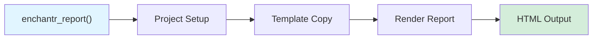

# Developer Guide

This document explains how the `enchantr` package is organized, how it works, how to add new reports, and how to modify the styling.

## Report Generation Workflow

The diagram below provides a high-level overview of how reports are generated in enchantr.



**User calls `enchantr_report()`**: The main entry point for generating reports:

```r
enchantr_report(name = "single_cell_qc", 
               report_params = list(outdir = "results/"))
```

**Project creation**: Based on the report `name`, the corresponding `*_project()` function is called. In the example, the `single_cell_qc_project` function. The function then copies the skeleton files from `inst/rstudio/templates/project/single_cell_qc_project_files/` to the output directory.

**Report rendering**: The report is rendered using `bookdown::render_book()`
   - Input file: `index.Rmd` in the project directory
   - Output format: `enchantr::immcantation` (custom HTML format)
   - Configuration: `_bookdown.yml`


## Package Organization

```
enchantr/
├── R/                          # R source code
│   ├── report.R                # Main report generation functions
│   ├── io.R                    # Input/output utilities
│   ├── format.R                # Custom output formats
│   ├── styles.R                # ggplot2 themes
│   ├── report-1.R              # report 1 functions
│   └── ...                     # Other reports
│
├── inst/                       # Templates
│   ├── assets/                 # Static assets
│   │   ├── logo.png            # Default logo
│   │   └── style.css           # CSS stylesheet
│   ├── rstudio/templates/project/  # Report templates
│   │   ├── report-1.dcf        # Report 1 project description file
│   │   ├── report-1_project_files/
│   │   │   ├── index.Rmd           # Report main R Markdown file
│   │   │   ├── _bookdown.yml       # Bookdown config
│   │   │   ├──references.bib      # Bibliography
│   │   │   └── ...
│   │   └── ...                     # Other report templates
│   ├── scripts/                # Additional scripts
│   └── js/                     # JavaScript files
│
├── man/                        # Documentation (auto-generated)
│   └── *.Rd                    # R documentation files
│
├── docs/                       # MkDocs documentation
│   ├── topics/                 # Documentation pages
│   ├── build.R                 # Documentation build script
│   └── mkdocs.yml              # MkDocs configuration
│
├── vignettes/                  # Vignettes documentation
│   └── *.Rmd                   # Vignette files
│
└── tests/                      # Test files
    └── testthat/               # Unit tests
```

The key directories in the `enchantr` package are:

- **`R/`**: Contains R source code
    - Core functionality files (e.g., `report.R`, `io.R`, `format.R`, `styles.R`) shared across reports
    - Individual report specific files (e.g., `single_cell_qc.R`, `clonal_assignment.R`, `contamination.R`). Each of this files has a `*_project` function that is used to initializes a report project using the template 
    project, and it can also contain report specific functions.
  
- **`inst/`**: Contains `.Rmd` templates and accessory files
    - `inst/assets/`: Static assets like `logo.png` and `style.css`
    - `inst/rstudio/templates/project/`: Project templates for each report type
        - one DCF file for each report. These are used to create R projects for each report type.
        - one subfolder for each report with name like `_project_files`
    - `inst/scripts/`: Additional scripts
    - `inst/js/`: JavaScript files
  
- **`man/`**: Auto-generated R documentation files (`.Rd` files)

- **`docs/`**: Documentation website source files (MkDocs format)

- **`vignettes/`**: Long-form documentation in R Markdown format

### More details on report templates

Report templates are located under `inst/rstudio/templates/project/`. Each report template directory is named like `<report-name>_project_files`
and contains:

- **`index.Rmd`**: Main R Markdown file with:
    - YAML front matter defining:
        - Report metadata (title, date)
        - Parameters (inputs, output directory, options)
        - Output format. The default `enchantr::immcantation` output format is defined 
          in the `R/format.R` file and extends bookdown's HTML format with custom CSS 
          styling, custom logo, and specific layout and theme options.
    - R code chunks for analysis and visualization
  
- **`_bookdown.yml`**: Bookdown configuration file specifying output directory, 
   chapter/figure/table labels, files to include in the book...
  
- **`references.bib`**: Bibliography file for citations (if needed)

- **`references.Rmd`** or **`versions.Rmd`**: Additional chapters showing the R session information, to track versions of the packages used during the analysis.

- **Sample data files** (optional): Example input files for testing. Best if input files can be loaded from a url to reduce the size of the installed package.

## Adding a New Report

To add a new report to `enchantr`, follow these steps:

### 1. Create an R file with report specific functions

Create a new file `R/<report_name>.R` with a project function:

```r
#' Create an Immcantation <Report Name> Project
#'
#' @param  path path to the directory where the project will be created
#' @export
<report_name>_project <- function(path, ...) {
    skeleton_dir <- file.path(system.file(package = "enchantr"), 
                              "rstudio", "templates", "project",
                              "<report_name>_project_files")
    project_dir <- path
    if (!dir.exists(project_dir)) {
        message("Creating project_dir ", project_dir)
        dir.create(project_dir, recursive = TRUE, showWarnings = FALSE)
    }

    project_files <- list.files(skeleton_dir, full.names = TRUE)
    file.copy(project_files, project_dir, recursive = TRUE)
}
```

Add any specific analysis functions needed for the report in the same file. Functions should be documented using roxygen. Add unit tests for relevant functions.

### 2. Create the DCF File

Create `inst/rstudio/templates/project/<report_name>.dcf`:

```
Binding: <report_name>_project
Title: Immcantation <Report Title>
OpenFiles: index.Rmd, _bookdown.yml
```

### 3. Create the Project Files Directory

Create `inst/rstudio/templates/project/<report_name>_project_files/` with:

#### a. The main `index.Rmd`

Example `index.Rmd` setup

````rmd
--- 
title: "Immcantation - enchantR"
subtitle: "<Report Title>"
author: "`r params$author`"
date: "Updated: `r date()`"
knit: enchantr::render_book
site: bookdown::bookdown_site
documentclass: book
bibliography: "references.bib"
biblio-style: apalike
link-citations: yes
description: "enchantR <Report Name> Report"
output: enchantr::immcantation
params:
   author:
       value: "Authors: Your Name"
   # Add report-specific parameters here
   input: 
      label: "`input`: Path to input file"
      input: file
      value: "input.tsv"
   outdir:
      label: '`outdir`: Output directory'
      input: text
      value: !r file.path(getwd(),'enchantr')
   logo:
      label: "`logo`: Path to report logo"
      input: file
      value: !r file.path("assets", "logo.png")
   echo: 
      label: '`echo`: Show code in the report.'
      input: checkbox
      value: TRUE
   cache:
      label: '`cache`: Use cached results'
      input: checkbox
      value: FALSE
---

```{r global-options, include=FALSE, cache=FALSE}
knitr::opts_chunk$set(fig.width = 7, fig.height = 4, fig.path = "figures/",
                      echo = params$echo, cache = params$cache,
                      warning = FALSE, message = FALSE,
                      eval.after = "fig.cap", out_dir = params$outdir)

# Load libraries
suppressPackageStartupMessages(library("enchantr"))
# Add other required libraries

if (!dir.exists(params[["outdir"]])) {
  dir.create(params[["outdir"]], recursive = TRUE)
}

file.copy(params$logo,
          file.path(params$outdir, "assets", "logo.png"),
          recursive = TRUE, overwrite = TRUE)
```

# Section 1

Add your analysis sections here...

```{r}
# Your analysis code
```

# References

````

#### b. `_bookdown.yml`

Example `_bookdown.yml`

````yaml
output_dir: enchantr
delete_merged_file: true
language:
   label:
      fig: 'Figure '
      tab: 'Table '
   ui:
      chapter_name: ''
rmd_files: ["index.Rmd"]
````

#### c. `references.bib`

Create a bibliography file with BibTeX entries for citations. Here's an example:

```bibtex
@article{Gupta2015,
    author = {Gupta, Namita T. and Vander Heiden, Jason A. and Uduman, Mohamed and Gadala-Maria, Daniel and Yaari, Gur and Kleinstein, Steven H.},
    title = {Change-O: a toolkit for analyzing large-scale B cell immunoglobulin repertoire sequencing data},
    journal = {Bioinformatics},
    volume = {31},
    number = {20},
    pages = {3356--3358},
    year = {2015},
    doi = {10.1093/bioinformatics/btv359}
}
```

**To cite references in your report**, use `[@citation_key]` in your R Markdown text:

```markdown
The data was  analyzed with Change-O [@Gupta2015].
```

Or for in-text citations without parentheses, use `@citation_key`:

```markdown
As described by @Gupta2015, the Change-O toolkit provides...
```

Multiple citations can be combined: `[@Gupta2015; @AnotherCitation2020]`

#### d. Any additional files

Add any required data files, additional Rmd files, or other resources.

### 4. Update `enchantr_report()`

Edit `R/report.R` to add the new report to both:

1. The function signature (allowed report names):
```r
enchantr_report <- function(name=c("validate_input", 
                                   "file_size",
                                   # ... existing reports ...
                                   "<report_name>"), 
                            report_params=list()) {
```

2. The switch statement:
```r
switch (name,
        "validate_input" = invisible(validate_input_project(outdir)),
        # ... existing cases ...
        "<report_name>" = invisible(<report_name>_project(outdir))
)
```

### 6. Test the New Report


**Interactively**

If your report has default input data and parameters, you can render it with:

```r
# Load the package
devtools::load_all()

# Test the report
enchantr_report(name = "<report_name>", 
                report_params = list(outdir = "test_output/"))
```

**Unit Testing**

There are two types of tests to add for a new report:

**1. Test individual functions**

Test any helper functions or analysis functions specific to your report. These tests should be placed in `tests/testthat/test_<report_name>.R`.

```r
# Example
# tests/testthat/test_<report_name>.R

# Create test data
test_data <- data.frame(
    sample_id = c("s1", "s1", "s2"),
    value = c(10, 20, 30)
)

# Test your functions
test_that("<function_name> works correctly", {
    result <- <function_name>(test_data)
    
    # Test expectations
    expect_true(inherits(result, "data.frame"))
    expect_equal(nrow(result), 3)
    expect_equal(result$value[1], 10)
})

test_that("<function_name> handles edge cases", {
    # Test with empty data
    expect_error(<function_name>(data.frame()))
    
    # Test with missing columns
    expect_error(<function_name>(data.frame(x = 1)))
})
```

**2. Test that the report renders successfully**

Ensure the full report generation works end-to-end:

```r
# Example
# tests/testthat/test_<report_name>.R

test_that("<report_name> report renders", {
    # Create temporary output directory
    outdir <- tempfile()
    dir.create(outdir)
    
    # Test report generation - returns path to output
    output_path <- enchantr_report(
        name = "<report_name>",
        report_params = list(
            outdir = outdir,
            input = "path/to/test/data.tsv"
            # Add other required parameters
        )
    )
    
    # Check that the return value is a valid path to the generated file
    expect_true(file.exists(output_path))
    expect_match(output_path, "index\\.html$")

    # Any additional checks
    
    # Clean up
    unlink(outdir, recursive = TRUE)
})
```

**Run tests:**

```r
# Run all tests
devtools::test()

# Run tests for a specific file
testthat::test_file("tests/testthat/test_<report_name>.R")

# Run with coverage
covr::package_coverage()
```

**Key testing guidelines:**

- **Individual functions:** Test input validation, output format, edge cases, error handling
- **Report rendering:** Test with minimal valid inputs, verify output files are created
- **Data transformations:** Verify calculations produce expected results
- **Error messages:** Check that appropriate errors are thrown for invalid inputs

### 7. Add Documentation

To create the [MkDocs](https://www.mkdocs.org/user-guide/) documentation for the website use:

```bash
# Install https://github.com/javh/markr if you don't have it
# clean old files
rm docs/topics/*
rm docs/vignettes/*
# generate .md documentation
Rscript docs/build.R
```

Update `mkdocs.yml` if there are new pages that you want to include in the navigation menu (left side bar) of the website. Use `mkdocs serve` to preview the rendered site in your browser (typically http://127.0.0.1:8000/).

## Modifying the CSS Template

The CSS template controls the visual styling of all enchantr reports. The main CSS file is located at `inst/assets/style.css`.

### Custom Logos

To use a custom logo without modifying CSS:

```r
enchantr_report(
  name = "single_cell_qc",
  report_params = list(
    outdir = "output/",
    logo = "path/to/custom_logo.png",
    logolink = "https://your-institution.org"
  )
)
```

The logo image dimensions should ideally be around 200-300 pixels wide for best display.

## ggplot2 Theme

In addition to the CSS for HTML reports, enchantr provides a custom ggplot2 theme for consistent plot styling. The theme is defined in `R/styles.R`. You can modify this function to change the default appearance of all plots in enchantr reports.

```r
library(ggplot2)
library(enchantr)

ggplot(data, aes(x, y)) +
  geom_point() +
  theme_enchantr()
```

## Coding standards

Follow the conventions in [CONTRIBUTING.md](https://github.com/immcantation/immcantation/tree/master/CONTRIBUTING.md).

Key points:

- Submit your changes via pull request
- Use informative variable and function names
- Add comments for complex logic
- Follow existing code formatting
- Include roxygen2 documentation for all exported functions
- Add examples to function documentation where applicable

## Getting Help

If you have questions or need assistance, check existing [GitHub Issues](https://github.com/immcantation/enchantr/issues). If your issue has not been adresed before in the issue tracker, open an new issue. You can reach us by email at [Immcantation Group](mailto:immcantation@googlegroups.com).
