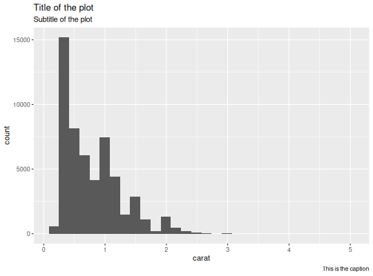

**eeplot** - *eeplot: a convenience function to save ggplot figures*

Description
--------------------

This function takes a `ggplot`, and saves it in an .RData file in
the `outdir` directory. It returns the same input `p` with an 
additional field,`enchantr`, with an `html_caption`
that can be used in html reports, to provide a download link to the figure file.


Usage
--------------------
```
eeplot(p, outdir = NULL, file = NULL, caption = NULL, ...)
```

Arguments
-------------------

p
:   ggplot figure

outdir
:   directory where the output file will be saved.

file
:   filename. If null, `p` will be used.

caption
:   catption for the image. Will be updated to add the path to
the output file.

...
:   Additional objects to be save in the same output file


Examples
-------------------

```R
library(ggplot2)
diamonds_plot <- ggplot(diamonds, aes(carat)) + geom_histogram() +
labs(title = "Title of the plot",
subtitle = "Subtitle of the plot",
caption = "This is the caption")
p <- eeplot(diamonds_plot, outdir=tempdir(), file="diamonds-plot")
p

```

*`stat_bin()` using `bins = 30`. Pick better value with `binwidth`.*

```R
p$enchantr$html_caption
```


```
[1] " <a href='ggplots/diamonds-plot.RData'>ggplot file: diamonds-plot.RData</a>"

```


